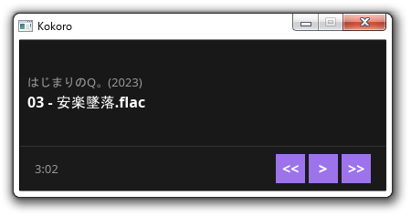

## player-rs
simple audio player made using Rust+Slint 

## preview


## why
just wanted to try the Slint UI library, it's pretty good ngl.

## features
- it plays audio
- basic playback control

## build

```bash
cargo build --release
```

## usage

```bash
cargo run --release -- /path/to/music_folder
```
